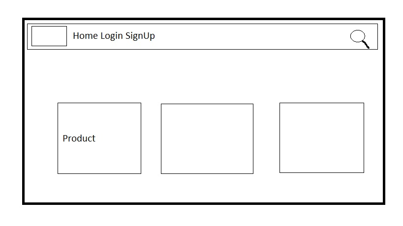
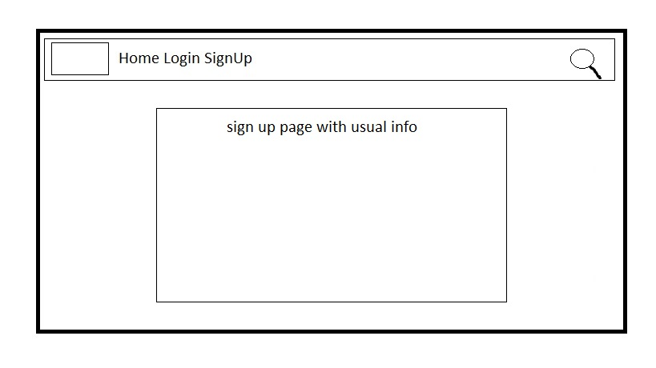
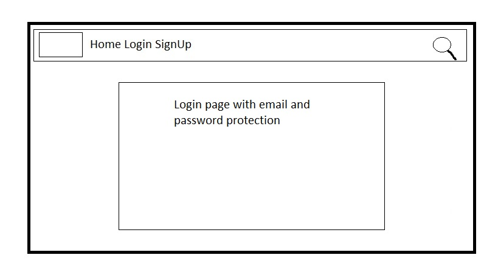
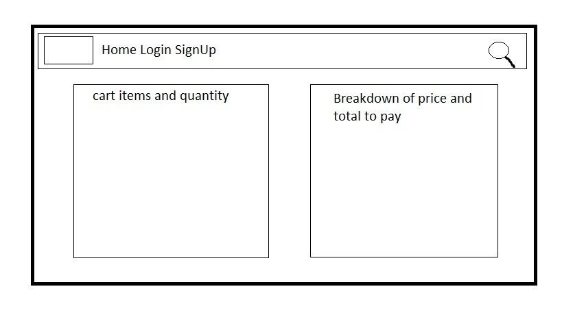

# Game on - Final Project

## Overview G4M3 ON
The idea behind this project is aimed toward the gaming world industry, 
with and ecommerce side to it along with an login function. The idea is 
that you can buy items from the site like clothing and other items game
related as well as a comment section/ review for each item on the website.

## Deployment:

For the project deployment I use Heroku for hosting and build information on any problems there might be for running the site such as packages, requirements needed or any broken links or incorrect code along with Amazon Web Services for storing information and images in a database

## Languages used:
- HTML5
- css / bootstrap
- python/ flask
- django
- javascript 

# Layout to the Project
## Base, Footer, Navbar
For the project I created the base HTML page for the main layout and inside that had the Navbar and Footer, which were seperate pages to allow easier editing in the future. Using the extend function to lay each into the page with ease.

The extends calls on the baase html page and adds in all the consistant layout for the pages
```html
 <!-- Calls on the base page layout-->
 <!-- loads the static files needed -->

Home              <!-- The title is changable with block title tag -->

```
The include calls on the specific file to add in such as the navbar and footer
```html


```

## Accounts

The accounts section of the app is responsible for the following thing:
- Login : Where an existing user can return and continue where they left off
- Sign Up : where a new user can create a profile and start to shop
- Logout : Securly exit out of the site 
- Forgotten password : Has a password retreval for a user if unable to log back in 

Inside this the use of the CSRF token was need for security when filling out the form and the styling was done using the crispy forms package

### Checkout
- The checkout app has the stripe functionality linked up for the ease of purchasing any items in the site securely. As I used the CSRF token in the accounts section it was used here for the smae reason as well as the crispy forms.

### Basket
- With the basket app the user can add multiple item to the basket and then checkout. It would have the normal functionality you'd expect that it would list and total the amount to be paid as well as being able to change quantity or remove items before checkout. 

### templates
- Using the templates ability of django I created the base.html page and
then used the extends function to keep the rest of the site the same just using 
small amounts of code on each page

### Setting

- inside the settings file was used to declare the apps the had been created for the project. The database roots was written in here but with the use of the SECRET_KEY for hiding sensitive information inside a file the cannot be accessed

### Models
- In this file held the layout to the was in which information was displayed inside various fields that was to be stored, login/out, stripe, billing, admin etc...

Example of the admin page of the site which would not been seen on the user end where the products would be uploaded with there information. As described further down the slug information is created here in the model.

```python

# Model created for handling the admin side of the site

class Category(models.Model):
    name = models.CharField(max_length=250, unique=True)
    slug = models.SlugField(max_length=250, unique=True)
    description = models.TextField(blank=True)
    image = models.ImageField(upload_to='category', blank=True)

    class Meta:
        ordering = ('name',)
        verbose_name = 'category'
        verbose_name_plural = 'categories'

    def get_url(self):
        return reverse('products_by_category', args=[self.slug])

    def __str__(self):
        return self.name

```

### Urls
In these file the urls for each page was created and them in the main urls were 
all linked in using the include() function along with the path call. Makes creating the link for pages a
lot easier for naming using the 

The urlpattern for the project
```python
from django.urls import path, include

urlpatterns = [
    
    # example 1: with the main root for the page
    path('account/create/', views.signupView, name='signup')

    # example 2: with the slug patten so that its
    # more user friendly as to web address of the item
    path('category/<slug:category_slug>', views.home, name='products_by_category')
]
```
an example of how the url path is written in the HTML, 
where a single word is defined for to file path to each page.
```html

<!-- The url link to the page name set up with readable -->

<li class="nav-item">
    <a href="">
        Sign Out 
    </a>
</li>
```

## Gitignore file and Requirements file

- The use of the gitignore file stores all the file that are to be ignore when saving a file but exist in the backgorund, such as the environment variables that handle the KEYS for Stripe and AWS.

- Requirements file is needed for the hosting of the project on Heroku

# Installed packages for the project:
With some of the installs I had a bit of trouble as they needed updating or a different command for installing


Installs:

Starting the project with the framework package
```bash
pip install django
```
This package handles the pictures that would be uploaded for item in the project
```bash
pip install pillow
```
The Stripe package handles the card payments securely for transactions
```bash
pip install stripe
```
This package is responsible for the layout of all the forms such as the login and payment details
```bash
pip install django-crispy-forms
```
Install the heroku command line for deployment
```bash
pip npm install -g heroku 
```

## Wireframes

### The wireframes to work from for the layout to the project





## Project Testing/ Feedback

Project test that were carried out through family, friend and collegues who checked the links and to see if there were any issues
Issues 
- Sometimes images not loading
- Broken links
- Products not being added to the category
- Checkout issues with Stripe

